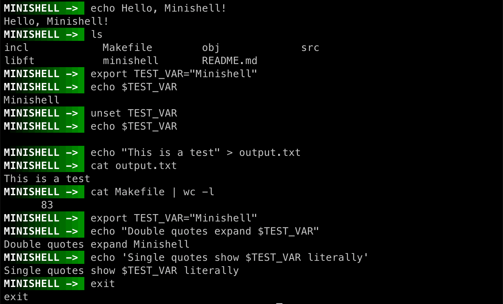

# 🐚 minishell

`minishell` is a simplified Unix shell implemented in C from scratch, developed as part of the 42 curriculum. It replicates essential features of a real shell, including command parsing, execution, redirections, environment variable management, and pipelines.

---

## 🛠️ Features

- ✅ Interactive prompt with readline support
- ✅ Command execution (builtins and external binaries)
- ✅ Pipes (`|`) and redirections (`>`, `>>`, `<`, `<<`)
- ✅ Environment variable expansion (`$VAR`)
- ✅ Signal handling (`Ctrl+C`, `Ctrl+D`, `Ctrl+\`)
- ✅ Support for quotes and escape characters
- ✅ Builtin commands:
  - `echo`
  - `cd`
  - `pwd`
  - `export`
  - `unset`
  - `env`
  - `exit`
- ✅ Exit status management (`$?`)

---

## 🚀 How to Run

### 🧪 Build the shell

```bash
make
```

### ▶️ Start the shell
```bash
./minishell
```

